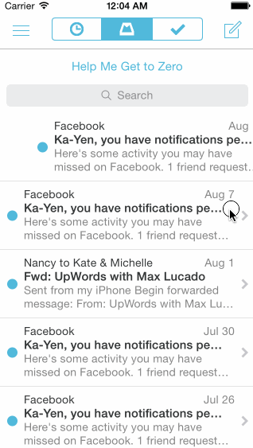

MailboxDemo
===========

This is an iOS prototype of the Mailbox app's animations.

Time spent: 10 hours spent in total

Completed user stories:

* On dragging the message left...
 * &#10004; Initially, the revealed background color should be gray.
 * &#10004; As the reschedule icon is revealed, it should start semi-transparent and become fully opaque. If released at this point, the message should return to its initial position.
 * &#10004; After 60 pts, the later icon should start moving with the translation and the background should change to yellow.
 * &#10004; After 260 pts, the icon should change to the list icon and the background color should change to brown.
* &#10004; User can tap to dismissing the reschedule or list options. After the reschedule or list options are dismissed, you should see the message finish the hide animation.
* On dragging the message right...
 * &#10004; Initially, the revealed background color should be gray.
 * &#10004; As the archive icon is revealed, it should start semi-transparent and become fully opaque. If released at this point, the message should return to its initial position.
 * &#10004; After 60 pts, the archive icon should start moving with the translation and the background should change to green.
 * &#10004; After 260 pts, the icon should change to the delete icon and the background color should change to red.
 * &#10004; User is taken to the tutorial screens upon entering the correct email/password combination.
 &#10004; Optional: Panning from the edge should reveal the menu

Walkthrough of all user stories:

GIF created with [LiceCap](http://www.cockos.com/licecap/).
